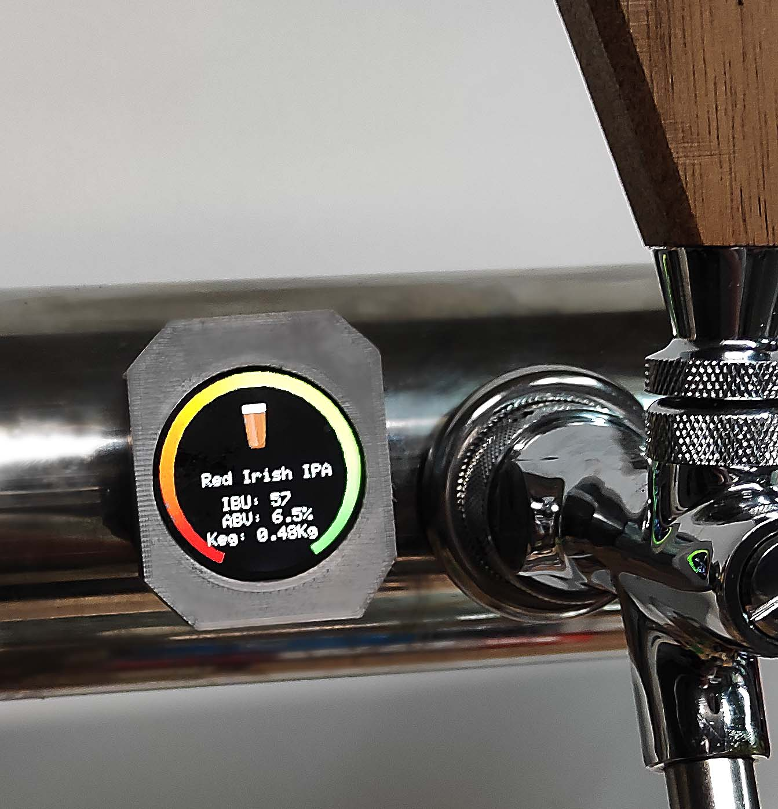
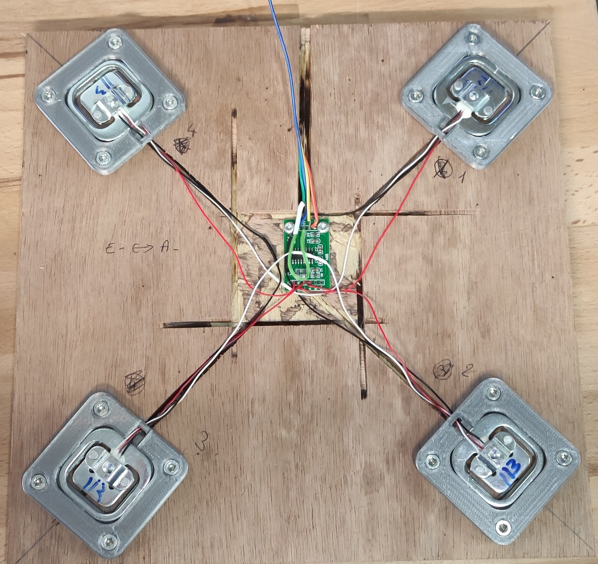
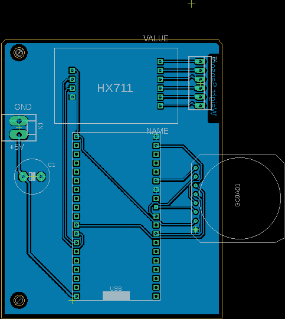

# BeerTapRoundDisplay
Kegerator custom display using GC9A01 1.4" round display, hx711 with weight sensors and ESP32.
Project is fully functionnal now for my needs. Lot of improvements are coming. 

##Hardware list
--DOC IN PROGRESS--
##Getting started
-- DOC IN PROGRESS--
##Flashing ESP32
-- DOC IN PROGRESS--
##Initial configuration
-- DOC IN PROGRESS--

