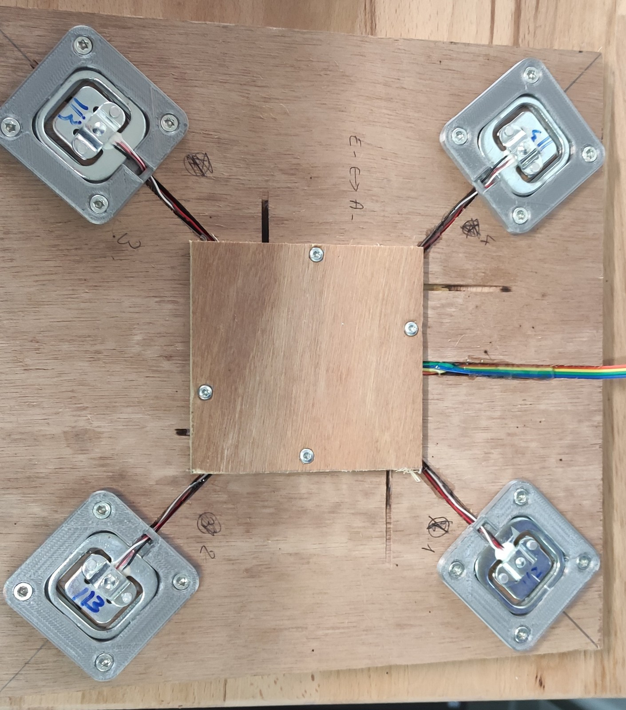
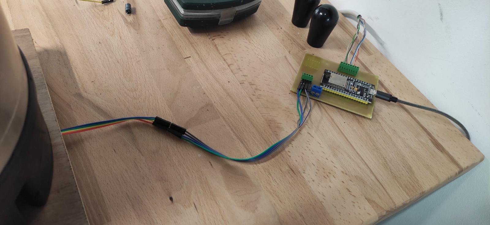

# BeerTapRoundDisplay
Kegerator custom display using GC9A01 1.28" round display, hx711 with weight sensors and ESP32.
Project is fully functionnal now for my needs. Lot of improvements are coming.

## Hardware list

<table>
<thead>
	<tr>
		<th>Hardware</th>
		<th>Indic. price</th>
		<th>Link</th>
	</tr>
</thead>
<tbody>
	<tr>
		<td>ESP32 (Az-Delivery)</td>
		<td>11.99€</td>
		<td><a href="https://www.amazon.fr/gp/product/B071P98VTG/ref=ppx_yo_dt_b_search_asin_title?ie=UTF8&th=1" target ="blank">Amazon</a></td>
	</tr>
	<tr>
		<td>GC9A01 1.28" Oled Display</td>
		<td>5.93€</td>
		<td><a href="https://www.aliexpress.com/item/1005004296043855.html?spm=a2g0o.order_list.0.0.5a9f1802KPwI7w" target ="blank">AliExpress</a></td>
	</tr>
	<tr>
		<td>HX711 + Weight Sensors</td>
		<td>4.20€</td>
		<td><a href="https://www.aliexpress.com/item/1005002176327047.html?spm=a2g0o.order_list.0.0.22171802zh8MgL" target ="blank">AliExpress</a></td>
	</tr>
	<tr>
		<td>(Optionnal) 5V power supply</td>
		<td>15.67€</td>
		<td><a href="https://www.amazon.fr/LED-Alimentation-15W-MeanWell-LPV-20-5/dp/B00MWQEMXG/ref=sr_1_57?crid=4FTTWEKA2H&keywords=5v+power+supply&qid=1656929563&sprefix=5V+po%2Caps%2C91&sr=8-57" target ="blank">Amazon</a> Could also be powered by ESP32 micro USB</td>
	</tr>
		<tr>
		<td>PCB</td>
		<td>To be defined</td>
		<td><a href="https://www.amazon.fr/LED-Alimentation-15W-MeanWell-LPV-20-5/dp/B00MWQEMXG/ref=sr_1_57?crid=4FTTWEKA2H&keywords=5v+power+supply&qid=1656929563&sprefix=5V+po%2Caps%2C91&sr=8-57" target ="blank">OSHPark / PCBWay / JLCPCB</a></td>
	</tr>
</tbody>
</table>

## Hardware schema and assembly

## Firmware configuration

